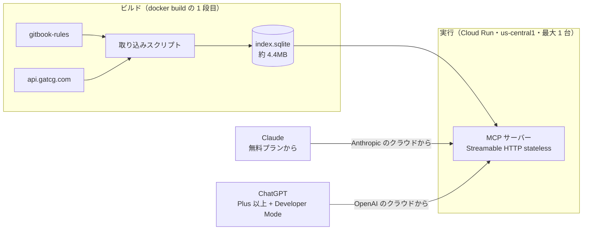
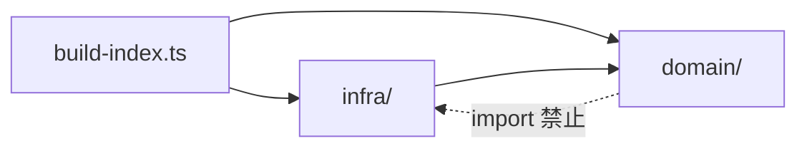
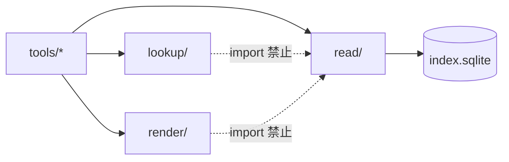
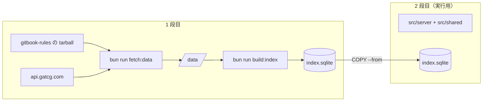
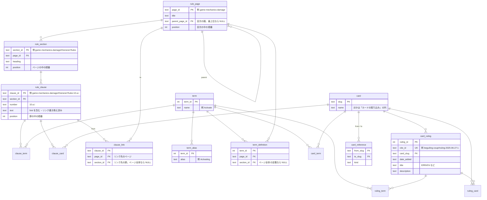

# Grand Archive ルール Q&A 用 MCP サーバー 設計書

## 目的

Grand Archive TCG のルールとカードについての質問に、利用者が自分の Claude / ChatGPT で答えを得られるようにする。推論は利用者側の LLM が行い、こちらは LLM を動かさない。

### 要件

- 非エンジニアが URL を貼るだけで使い始められる
- ルールの質問・「こんなカードある？」・カード同士の関係に答えられる
- 1 分以内に答える
- 正解が 1 通りに定まるゲームなので、答えを外さない。外しそうなときは「見つからない」と言わせる

### この設計の中心にある判断

サーバーは「答えるもの」ではなく「原文を出典つきで返すもの」にする。どの原文をどこまで返すかの判断を検索エンジンの当たり外れに任せず、目次とテーブルの結合で決まる形にする。

## 前提となる実測値（2026-09 時点）

| 対象                                                | 値                                                                                                                                             |
| --------------------------------------------------- | ---------------------------------------------------------------------------------------------------------------------------------------------- |
| ルール文書                                          | [weebsoftheshore/gitbook-rules](https://github.com/weebsoftheshore/gitbook-rules)。英語の Markdown 111 ファイル、368KB                         |
| ルールページ（用語集・変更履歴・目次を除く 104 枚） | 中央値 374 / 90% 1,402 / 最大 3,232 トークン                                                                                                   |
| 用語集                                              | `glossary/keywords-and-abilities.md` 64 節・`glossary/game-terms.md` 65 節。1 ファイル 1 万トークン前後、1 節は中央値約 120・最大 546 トークン |
| 目次 `SUMMARY.md`                                   | 2,714 トークン                                                                                                                                 |
| カード                                              | `api.gatcg.com` で 2,495 枚（edition 4,941）。英語版のみ                                                                                       |
| 公式裁定                                            | 478 枚に計 642 件                                                                                                                              |
| カード間の参照                                      | 257 枚から 372 本。最大 2 ホップ、閉路なし                                                                                                     |
| 索引一式                                            | SQLite 1 ファイル、約 4.4MB                                                                                                                    |

トークン数は英文 4 文字 ≒ 1 トークンで見積もった。

## 全体構成



## 配布とホスティング

- HTTPS のリモート MCP サーバーを 1 台置く。ChatGPT は手元で動く stdio のサーバーに接続できないため。
- 転送方式は Streamable HTTP の stateless モード。Cloud Run は台数 0 まで縮み、別の台が起き上がることもあるので、サーバーはセッションの状態を持たない。SSE は旧仕様なので使わない。
- 認証は付けない。OAuth を挟むと「URL を貼るだけ」の手順が成り立たない。
- `index.sqlite` をコンテナイメージに焼き込む。永続ボリュームも外部 DB も持たない。
- 置き場所は Google Cloud Run。リージョンは無料枠の対象になる米国（`us-central1` など）にする。サーバーを呼ぶのは利用者の PC ではなく Anthropic / OpenAI のクラウドなので、日本のリージョンにしても速くならない。
- 採らなかった置き場所
  - Render の無料プラン: 15 分リクエストが無いと停止し、起き上がりに約 1 分かかる。1 分要件を破る。
  - Fly.io: 新規アカウントに無料枠が無く月 $2〜4。Cloud Run より高いだけ。
  - Cloudflare Workers + D1: SQLite の拡張を載せられない。
- 濫用への備えは、Cloud Run の最大インスタンス数を 1 にして請求額に上限を付けること（最悪の場合で月 $60 前後）と、予算アラートを $5 に置くこと。Cloudflare の無料プランのレート制限は送信元 IP ごとにしか数えられず、リクエストは Anthropic / OpenAI のクラウドのわずかな IP から届くので、全利用者を 1 つの枠にまとめてしまう。使わない。

### 費用（1 日 100 質問 × 最大 8 回 = 月 2.4 万リクエストの場合）

| 項目                                                                                                                                      | 月額                                 |
| ----------------------------------------------------------------------------------------------------------------------------------------- | ------------------------------------ |
| Cloud Run（無料枠: 200 万リクエスト・18 万 vCPU 秒・36 万 GiB 秒・北米向け転送 1GB。この負荷は 1 リクエスト 1 秒と見ても 2.4 万 vCPU 秒） | $0                                   |
| Artifact Registry（無料枠 0.5GB、イメージは 100MB 前後）                                                                                  | $0                                   |
| GitHub Actions（毎日 2 分のビルドで月 60 分）                                                                                             | $0                                   |
| 独自ドメイン（任意。`*.run.app` で足りる）                                                                                                | $0（付けるなら年 $10〜15）           |
| LLM の推論                                                                                                                                | $0（利用者のサブスクリプション持ち） |

- 利用者の手順
  - Claude: Customize > Connectors > + > Add custom connector に URL を貼る。無料プランでもコネクタを 1 つ追加できる。
  - ChatGPT: Developer Mode を有効にしてからコネクタに URL を貼る。Plus 以上の有料プランでしか使えない。

## 実装基盤

取り込みもサーバーも TypeScript + Bun で書く。引用 ID の組み立て（取り込み）と解釈（サーバー）、テーブル定義を同じコードで共有し、両者の食い違いを型で防ぐ。SQLite は Bun 同梱の `bun:sqlite` を使う。Bun 1.4.2 同梱の SQLite 3.53.2 で `fts5(tokenize='porter unicode61')` が動くことを確かめた。

### リポジトリ構成

リポジトリ直下を 1 パッケージにする。

```
package.json      packageManager: "bun@1.4.2"
Dockerfile
.dockerignore     .git・.devcontainer・node_modules などを除く
src/
  server/         Hono + MCP。イメージの 2 段目に入る
  build/          取得 → index.sqlite。イメージの 1 段目だけで動く
  shared/         テーブル定義・引用 ID。両方の段に入る
```

- Bun のバージョンは `package.json` の `packageManager` を正とし、CI の `setup-bun` と Dockerfile の `oven/bun` のタグを合わせる。
- 採らなかった構成: Bun workspaces で 3 パッケージに分ける。取り込みは `fetch` と `bun:sqlite` で書け、分ける依存がほぼ無い。設定ファイルが 3 組になるだけ。

### 索引ビルドのコード構成

`src/build/` を、ビジネスロジック（`domain/`）と入出力（`infra/`）の 2 層に分ける。誤りの修正・条文への分解・用語の照合・結び付きの生成は、データを受け取ってデータを返す関数にし、取得元やデータベースから切り離して文字列だけでテストできるようにする。

```
src/build/
  domain/                 純粋な関数と型だけ。入出力をしない
    model.ts              Page / Section / Clause / Term / Card / Ruling などの型
    errors.ts             DataError
    corrections/          修正の一覧（データ）と適用
    errata/               効果テキストに当たっていない ERRATA の検出
    rules/                ページ・節・条文への分解、リンクの解決と書き換え
    terms/                用語・別名・定義の場所の抽出、照合器
    relate.ts             条文・カード・裁定と、用語・カード名を結ぶ
  infra/                  外とのやりとりだけ
    fetch/                GitHub と api.gatcg.com からの取得（bun run fetch:data）
    raw-store.ts          data/ の読み書き
    index-writer.ts       drizzle で index.sqlite に書き込み、FTS5 を作る
  build-index.ts          組み立て役。infra で読む → domain で変換する → infra で書く
src/shared/db/schema.ts   drizzle のテーブル定義（infra とサーバーが使う）
src/shared/db/fts.ts      FTS5 の仮想テーブルの SQL
src/shared/cite.ts        引用 ID の組み立てと解釈
```



- 依存は `infra/` → `domain/` の一方向。`domain/` から `bun:sqlite`・`node:*`・`drizzle-orm`・`infra/` を import すると、oxlint の `no-restricted-imports`（`.oxlintrc.json` の `overrides`）で `bun run check` が失敗する。分けたつもりでも、守らせる仕組みが無いと崩れる。
- drizzle のスキーマはテーブルの形でありインフラの関心事なので、`domain/` は参照しない。`domain/` の型から行への変換は `index-writer.ts` で行う。
- 結び付きは TypeScript でメモリ上に作ってから書き込む。データはカード 1.8MB・ルール 0.7MB でメモリに載る。照合の規則（長い語から先に当てる・複数形・単語境界・別名）は SQL では書きにくく、FTS の語幹照合では「`Element Bonus` の中の `Element` を数えない」を表せない。
- テーブルを作る SQL は、ビルドのたびに `drizzle-kit/api` の `generateSQLiteMigration` で、空の状態から現在のスキーマまでの差分として作る。索引は毎回作り直すのでマイグレーションの履歴は意味を持たず、SQL のファイルを持たなければ生成し忘れも起きない。`drizzle-kit/api` はコマンドラインほど文書化されていないので、生成した SQL でテーブルが作れることをテストで確かめる。`drizzle-kit` は開発用の依存なので、Docker の 1 段目だけ開発用の依存も入れる。
- FTS5 の仮想テーブルは drizzle が扱えないので、SQL を手で書く（`src/shared/db/fts.ts`）。
- 異常は最初の 1 件で `DataError` を投げて止め、`index.sqlite` は書き込まない。
- クラスは照合器の 1 つだけ（組み立てた正規表現を持ち回す）。ほかは関数と型で組む。
- 採らなかった構成
  - ポート（リポジトリのインターフェース）・ユースケースのクラス・依存性の注入。取得元も書き込み先も実装が 1 つずつで、テストでも差し替えない。`domain/` は入出力をしないので、テストはデータを直接渡せば足りる。
  - 層を分けず 1 ディレクトリに関数を並べる。入出力をしない関数に、いつの間にか `bun:sqlite` が混ざっても気づけない。

### サーバーのコード構成

サーバーは書き込まない。1 回のツール呼び出しでするのは「入力を読み解く → DB から読む → Markdown に整える」だけで、守るべき業務の規則が無い。この 3 つで `src/server/` を分ける。

```
src/server/
  index.ts        起動。DB を読み取り専用で開き、catalog を読み、Hono に渡す
  app.ts          Hono の /mcp
  mcp.ts          組み立て役。McpServer を作り、tools/ を登録する
  tools/          1 ツール 1 ファイル。名前・説明文・zod の入力スキーマと、lookup → read → render をつなぐ handler
  read/           DB を読む関数。素のオブジェクトを返す
    catalog.ts    起動時に 1 回読む、変わらないデータ
  lookup/         入力を読み解く純粋な関数（カード名の類似度・検索語の分解・属性の値の照合）
  render/         素のオブジェクト → Markdown の純粋な関数
  log.ts          1 呼び出し 1 行の JSON
```



- `lookup/` と `render/` から `bun:sqlite`・`drizzle-orm`・`read/` を import すると、oxlint の `no-restricted-imports` で失敗する。整形の途中で「ついでに 1 件引く」SQL が紛れ込むのを防ぐ。
- データはプロセスが動いている間変わらないので、カード名の一覧（`find_cards` の類似度）・属性の値の一覧（`search_cards` の照合と候補）・用語と別名・目次と概要は起動時に `catalog` へ読み、全リクエストで使い回す。作り直す仕組みは要らない。
- `render/` は複数のツールで共有する。「条文に引用 ID を付けて並べる」は `get_rules_page`・`get_term`・`get_card`・`get_game_overview` が、「カードを 1 行にする」は `search_cards`・`find_cards` が使う。
- 読み出しは drizzle で書き、FTS5 の `MATCH`・`bm25`・`snippet` だけ `sql` のテンプレートで書く。
- ツールを 1 回呼ぶごとに、ツール名・引数・件数・所要時間を JSON 1 行で標準出力に書く。Cloud Run が Cloud Logging に取り込むので、件数 0 で絞れば該当なしの呼び出しが集まる（「検証」の運用）。
- 採らなかった構成
  - ポート・ユースケースのクラス・依存性の注入。読み出し先は SQLite 1 つで、テストも実データで回すので差し替える相手がいない。
  - 索引ビルドと同じ `domain/` と `infra/`。サーバーには業務の規則が無く、`domain/` に入るのが整形と照合だけになる。
  - ツールごとのディレクトリ（`tools/get-card/{read,render}.ts`）。整形の半分以上が複数のツールで共有され、結局共有の置き場が要る。
  - ツール 1 ファイルに SQL も整形も書く。「条文に ID を付けて並べる」が 4 か所に書かれ、表記がずれていく。

### データの取得と焼き込み

ルール文書もカードも頻繁に更新されるので、リポジトリに置かない。イメージを作るたびに最新を取得して焼き込む。

取得（`bun run fetch:data`）と索引の作成（`bun run build:index`）を分ける。取得した原本は `data/` に置き、手元でも Docker の 1 段目（`/app/data`）でも同じ構成にする。手元では 1 度取得すれば、ネットワークなしで索引を何度でも作り直せる。`data/` と `index.sqlite` は git の管理外にする。

```
data/
  rules/        gitbook-rules の .md だけ（リポジトリと同じ木構造。.gitbook/ の画像は展開しない）
                直下の README.md（変更履歴）と table-of-contents.md（SUMMARY.md と同じ目次）は捨てる
  cards/        <slug>.json に 1 枚ずつ。「カードの取り込み」の列だけを整形して書く（2,495 ファイル・計 1.8MB）
  source.json   取り込んだルールのコミット SHA・カード枚数・取得日時
```



- 取得は Dockerfile の中で行う。`docker build` 1 回で「最新を取得してイメージを作る」が済み、手元・CI・Cloud Build のどこでも同じものができる。
- 取得の直前に `ARG DATA_VERSION` を置き、ビルドごとに値を変える。レイヤーキャッシュが効くと、古いデータのまま新しいイメージができる。
- ルール文書は `git clone` ではなく GitHub の tarball で取る。`oven/bun` のイメージに `git` が無く、`tar` はある。ブランチの先頭の SHA を先に API で決めてから、その SHA の tarball を取る。ブランチ名で取ると、その間に push が入ったとき `source.json` の SHA と中身がずれる。
- 採らなかった方法: CI で `index.sqlite` を作って Dockerfile で `COPY` する。手元の `docker build` だけでは DB が無いか古くなる。

### MCP の実装

公式 SDK `@modelcontextprotocol/sdk` の `WebStandardStreamableHTTPServerTransport` を Hono の `/mcp` から呼ぶ。`sessionIdGenerator: undefined` で stateless にし、リクエストごとに server と transport を作る。ツールの入力スキーマは zod で書く。

- SDK の transport は仕様どおり、POST の `Accept` に `application/json` と `text/event-stream` の両方が無いと 406 を返す。curl で試すときは両方を付ける。Claude・ChatGPT が両方を送るかは実機で確かめ、送らなければ Hono のミドルウェアで補う。
- 採らなかった方法: `@hono/mcp`。SDK を包むのではなく transport を独自に書き直したもの（0.3.2 で 560 行）で、仕様の改定への追従が SDK より遅れうる。利点は OAuth の補助と `Accept` の緩い判定だが、認証は付けず、利用者は仕様どおりのクライアントなので使わない。使わない認証のモジュールも無条件に読み込まれ、`hono-rate-limiter` が必須の peer として入る。

### 検査

| 検査         | ツール                                             |
| ------------ | -------------------------------------------------- |
| フォーマット | `oxfmt --check`（既定の設定）                      |
| リント       | `oxlint` + `oxlint-tsgolint`（型情報を使うルール） |
| 型           | `tsc --noEmit`                                     |
| テスト       | `bun test`（索引ビルド）・`bun run test:server`    |

- 4 つを `bun run check` にまとめ、GitHub Actions で PR と main への push のたびに実行する。手元では devcontainer の `oxc.oxc-vscode` で保存時に整形する。pre-commit フックは置かない。
- サーバーのテストは CI で回さず、手元で `bun run test:server` を実データの `index.sqlite` に対して回す。CI には `data/` が無く、取得すると外部につなぐ 40 秒が毎回かかり、取得先の更新で結果が変わる。`index.sqlite` が無ければ飛ばさずに失敗させ、`fetch:data` と `build:index` を案内する。黙って飛ばすと通ったと思い込む。フォーマット・リント・型はサーバーのコードにも CI でかける。
- サーバーのテストは主に `tools/` の handler を直接呼んで返る文字列を確かめ、HTTP を通すテストは配線の確認に 1〜2 本だけ置く。
- Bun は型を見ずに実行し、oxlint・oxfmt も型を検査しないので、`tsc` を別に回す。
- `oxlint-tsgolint` を入れるのは `no-floating-promises` などを動かすため。`await` を書き忘れると、取得のエラーが握りつぶされて件数の足りない DB ができる。

## ビルド

### ルール文書の取り込み

1. 先頭の YAML（`---` で囲まれた GitBook のページ設定。3 ページにある）を捨てる。
2. `` ブロックを、直前の条文の続きとして本文に残す。`warning` / `danger` は「例外:」、`info` / `success` は「例:」を頭に付ける。**hint には条文を打ち消す例外が入っている**（例: `game-mechanics-damage.md` の規則 13 と、その直後の Immortality の例外）。捨てたり条文と切り離したりすると誤答になる。
   - hint の本文は 1 行にまとめる。`search_rules` は条文を 1 行で見せるので、行頭の「例:」「例外:」で hint を見分け、「例:」は外し「例外:」は ` / 例外: ...` と区切って残す。
   - 本文頭の `E.g.,` は消す（「例: E.g.,」と重ねない）。画像と斜体の説明文だけの hint は、画像を消すと説明する相手が無いので捨てる。
3. GitBook と Markdown の記法を消す。条文の本文はモデルがそのまま読むので、記法が残ると文の一部に見える。
   - `` タグ・Markdown の画像（``）・`<br>`・`&#x20;`・行末の `\`（強制改行）・エスケープの `\`。画像はモデルに渡さない。
   - 強調の `**` と単語の両端の `_` はすべて消す。原文には `sid**e**`・`"_may"_` のように崩れた強調がある。
   - 番号の無い箇条書きは `- ` に揃え、行を分けたまま直前の条文に入れる。
   - ページ題の下のパンくず `General Rules:` と、子ページへの案内（「The following pages discuss these topics:」とリンクだけの箇条書き）は条文にしない。子ページは目次が示す。
   - 画像を消して空になった `####` 見出しは節として扱わず、その下の条文は直前の節に含める（`game-mechanics-mastery.md:88` の `Shifting Currents` の図）。条文が 1 つも無い節（`#### List of restriction abilities`）も出さない。
   - 一般の規則で直せない文の崩れ（消えた図を指す「as shown below」など）は「データの誤りの修正」に `rule-text` として 1 件ずつ書く。
4. ページを **ページ → 節 → 条文** の 3 層に分ける。
   - 節は `####` 見出し 1 つ。`General Rules:` のような全般の決まりの節と、`Bulwark` のように 1 つの概念を定義する節がある。同じページに同じ見出しは無い（実測）。
   - 条文は番号付きの項目 1 つ（約 1,500）。入れ子の番号は GitBook の表示に合わせて `10.a.i` と書く。ルール本文の中の相互参照（「rule 10.a.i」）がこの書式で、ページ内を指している。番号は節ごとに 1 から振り直され、ルール文書に通し番号はない。
   - hint は直前の条文に含める（手順 2）。
5. 節と条文に**引用 ID**（回答で出典として示す識別子）を振る。節は `ページID#見出し`、条文は `ページID#見出し:番号`。例: `game-mechanics-damage#General Rules:10.a.i`。
6. 本文中のリンク（`SUMMARY.md` を除き約 190 本）を引用 ID に書き換え、結び付き（`clause_link`）としても記録する。
   - `[inner lineage](../game-mechanics/.../game-zones-object-specific-zones.md#inner-lineage)` → `[inner lineage](game-zones-object-specific-zones#Inner Lineage)`。相対パスのままではモデルがどのツールで開けばよいか分からない。
   - リンクは書き手が示した結び付きなので、同じ名前の定義が複数ある用語（`Lineage (term)` と `Lineage (Keyword)`）でも、どちらを指すかが確定する。
   - `#` の後は GitBook が見出しから作るアンカー（小文字・記号除去・空白をハイフン）か、見出しに埋め込まれた `<a id="...">`。リンク先の節が無いリンクが 3 本ある（見出しの名前が変わってリンクが古いまま）。「データの誤りの修正」で直す。
   - 画像へのリンク（`.gitbook/assets/`）は捨てる。
   - リンクの文字列の前後の空白はリンクの外に出す（`[Loaded Cards ](...)zone` → `[Loaded Cards](...) zone`）。文字列がファイル名のリンク（GitBook のページへの mention、`[game-terms.md](...)`）は、文字列をリンク先のページ題にする。
7. ページ・節・条文に並び順（`position`）を振る。ページの順と親子は目次 `SUMMARY.md` の入れ子から取り、`rule_page.parent_page_id` に持つ。`get_game_overview` の目次と、`get_rules_page` が条文からページを組み立て直すのに使う。条文の番号を文字列で並べると `10` が `2` より前に来るので、番号では並べない。
8. ページの原文は持たない。`get_rules_page` は条文から組み立て直し、条文ごとに引用 ID を付けて返す。原文の行は、手順 3 で捨てるものを除いてすべて条文か節の見出しに入る（太字の小見出し `**1.1 Announcing Activation**` も節になる）ことを全 108 ページで確かめた。
9. 概要に抜き出す 5 ページ（「最初に渡すゲームの概要」）のどれかが無ければビルドを止める。

### カードの取り込み

- `GET https://api.gatcg.com/cards/search?page_size=50&page=N` を `total_pages`（約 50）まで呼ぶ。`page_size` の上限は 50。
- 1 ページに約 2.5 秒かかる。順に呼ぶと 1 分 40 秒、5 本ずつ並べると 40 秒。10 本並べても 1 本あたりが遅くなるだけなので、取得先の負担を考えて 5 本にする。
- 連結した件数が応答の `total_cards` と一致しなければ失敗させる。ページの取りこぼしは HTTP のエラーにならない。
- 既定の User-Agent では 403 が返る（Python の `urllib` で確認）。User-Agent を明示する。
- 保存する列: `slug`, `name`, `types`, `subtypes`, `classes`, `elements`, `cost`, `level`, `power`, `life`, `durability`, `speed`, `effect_raw`, `rule`, `references`, `legality`。API の応答は 1 枚約 12KB あるが、残すのは 1 枚 1KB 未満。
  - 元素は `elements` だけを残す。`element` は 1 つしか持たず、84 枚で `elements` と食い違う。
    - Exalted のカード 80 枚: `element` は `EXALTED` だけで、`elements` は `["EXALTED", "FIRE"]` など。Exalted のカードは他の元素も併せ持ち、プレイには両方が要る（`game-mechanics-special-elements.md` の Exalted 2・3）。`element` を渡すと Fire などの条件が抜けて誤答する。
    - マスタリー 4 枚: `element` は `NORM` で、`elements` は `[]`。マスタリーはプレイしない（`game-mechanics-mastery.md` の 3）ので、元素なしで正しい。
  - コストは `cost`（`{type, value}`）を使う。`cost_reserve` / `cost_memory` は X コストを `-1` で表し（`sidereal-spellshot` など）、そのまま渡すと「コスト −1」と誤答する。
  - `legality` はフォーマット（STANDARD / PANTHEON / DRAFT）ごとの禁止で、149 枚にある。学習データの古い禁止リストで答えさせないために残す。
- 捨てる列
  - `editions` / `result_editions`: 印刷ごとの情報（セット・レアリティ・画像・foil）で、応答の 9 割以上を占める。印刷面の効果テキストは 209 枚で上の `effect_raw` と違う（古い印刷や注釈文の省略。71 枚は ERRATA の裁定あり）。答えの根拠は `effect_raw` と裁定にする。
  - `effect` / `effect_html`: `effect_raw` と同じ内容の Markdown 版（カード名が `CARDNAME`）と HTML 版。太字は用語の抽出に使わない。
  - `element`: 上記のとおり `elements` で足り、Exalted のカードで条件が落ちる。
  - `referenced_by`: `references` の逆向き。索引では結合で引ける。`references` にあって `referenced_by` に無い組が 5 件あるので、`references` を正とする。
  - `flavor`, `uuid`, `created_at`, `last_update`。
- `rule`（公式裁定）と `references`（`kind` が SUMMON / STATUS / MASTERY / GENERATE / REFERENCE / BREW）は別テーブルに展開する。
- 裁定に引用 ID `カードslug#ruling:日付:n` を振る（例: `beguiling-coup#ruling:2025-06-27:1`）。n は同じカード・同じ日付の中での順番で、取得元が返した順に 1 から振る。
  - API に裁定ごとの ID は無く、「カード + 日付」も 91 組で重なる。`card_ruling.ruling_id` はビルドのたびに振り直す連番なので出典に使えない。
  - 裁定は日付付きで後から足されるので、日付を含めれば既存の ID はビルドをまたいでも変わりにくい。通し番号だけ（`#ruling:n`）だと、取得元の並びが変わったときに別の裁定を指す。
  - 裁定を返すツールが 3 か所あるので、サーバーで数えずにビルドで列に入れる。

### 用語の抽出（リンクを張る処理）

条文・カード・裁定と、用語やカード名とを結ぶ。すべてビルド時の文字列照合で、実行時には計算しない。

- **語彙**: 全ページの `####` 見出しと、ページ題の最後の区切り（`# Game Zones - Intent` → `Intent`）から作る。約 316 語。用語集の見出しだけでは足りない。`Omen` は `game-mechanics-counters.md` の節に、`Intent` は 1 ページ丸ごとに定義があり、用語集には無い。
  - `General Rules` / `General Rules:` の節（80 個）は用語にしない。
  - 見出しから機械的に名前を作る。`<a id>` を外し、末尾の ` N`（`Critical N`）と括弧の補足（`Lineage (term)`）を外す。`/` と `and` で並んだ語（`Activate/Activating`・`Died/Dies and Kills/Killed`）は別名として持つ。
- **名前と定義の場所を分ける**: 同じ名前の定義が複数の場所にある。`Bulwark`（カウンターとキーワード能力）・`Durability`（ステータスとカウンター）・`Lineage`（用語とキーワード能力）は意味が違い、`Redirect`・`Last-Known Information` は詳しい説明と用語集の要約。本文の「Bulwark」がどちらの意味かは文字列の照合では決められないので、本文の語は名前（`term`）に結び、`get_term` は定義（`term_definition`）をすべて返して、文脈からモデルに選ばせる。定義を 1 つに絞ると、カウンターとしての意味などが消える。
- **当たったものはすべて記録する**: 1 枚あたり中央値 7 語、上位 10% で 10 語当たり、大半は `Champion`（942 枚）・`Target`（773 枚）のような基本語。索引には事実をすべて持たせ、何を見せるか（当たるカードが少ない順に上位 N 語など）はツールの側で決める。除外リストやしきい値を索引に埋め込むと、使ってみて変えたいときに取り込みからやり直しになる。
- **記録する単位**: ルール文書は条文単位で結ぶ（`clause_term`・`clause_card`）。ページ単位では「どの条文か」を後から復元できず、モデルが最大 3,000 トークンのページを丸ごと読むことになる。ページ単位が欲しいときは条文からたどる。
- **照合規則**
  - 大文字小文字を無視し、単語境界を付ける。
  - 複数形（末尾の `s`）も当てる。本文は `omens` と書く。
  - 長い語から先に当てる。短い語から当てると `Element Bonus` の中の `Element` を別の用語として二重に数える。
  - `effect` の太字（`**...**`）は使わない。`Class Bonus` は 906 枚に出るのに一度も太字になっておらず、逆に `On Enter:` のようにコロン込みで太字になった語が混ざる。
- **目で確かめる語**: `Link`・`Command`・`Brew`・`Vigor` のように一般語と紛れる短い語は、抽出結果を一度目視で確かめる。
- **カード名**: 条文と裁定にカード名が出る箇所も結ぶ。2 語以上かつ 8 文字以上の名前に限る（2,392 / 2,495 件）。短い名前は一般語と衝突する。いまのルール文書では 59 枚・31 ページに出る。`Divine Comedy` などのマスタリーは、効果の説明が `game-mechanics-mastery.md` にしか無い。
- **照合器**: 用語約 316 語・カード名 2,392 語を、条文約 1,500・カード 2,495 枚・裁定 642 件に当てる規模なので、正規表現の選択（`|`）に長い語から並べれば足りる。Aho-Corasick のライブラリは入れない。
- **カード同士の参照**は API の `references` だけを使う。効果テキストからカード名は拾わない。

### データの誤りの修正

取得元のデータに誤りと思われるものがあれば、推測で補正せず、リポジトリの修正の一覧（`src/build/domain/corrections/`）に 1 件ずつ明示して直す。

- 1 件ごとに、どのデータの・どの値を・何に直すか・なぜ直すかを書く。
- 修正は `build:index` で適用する。`data/` は取得した原本のままにし、何を直したかがコードを読めば分かるようにする。
- 一覧に無い異常（参照先のカードが無い・リンク先の節が無いなど）が見つかったらビルドを止める。人が確かめて一覧に足してから、もう一度ビルドする。止まっても、動いているサーバーは前の索引のまま動き続ける。
- 一覧の項目が当たらなくなったら（取得元で直った、または別の値に変わった）、その項目を名指ししてビルドを止める。後者を見逃さないため、人が確かめてから一覧から消す。
- 2026-10 時点で一覧に入れるもの
  - カード参照の slug `crystal-mastery` → `fractured-memories`（5 本。参照の `name` は `Fractured Memories` で、API に `crystal-mastery` は無く 404）。
  - リンク先の節が無いリンク 3 本: `game-terms.md#negated`、`game-terms.md#have-gain-get-become-are`、`general-rules-card-characteristics/#changing-characteristics-type-overwriting-and-type-setting`。
  - 効果テキストに当たっていない ERRATA（61 枚）。`card-text` として `src/build/domain/corrections/errata.ts` に置く。
  - 題が空の ERRATA 1 件（`archon-broadsword`）。`ruling-title` で題を直す。
- ERRATA を効果テキストに当てる
  - API の効果テキスト（`effect_raw`）は、ERRATA を反映済みのカードと未反映のカードが混ざっている。未反映のまま出すと、モデルが直す前の文面を引用する。
  - ERRATA の文面は断片で（`your -> their owner's` の `your` が効果テキストに 3 か所ある）、句読点や表記（`’`、`pay 2`、`power`）も効果テキストと揃わない。自動では置き換えず、置き換える箇所と文面をカードごとに `card-text` で書く。
  - ビルドは、ERRATA の左側（直す前）が効果テキストに残り右側（直した後）が無いカードを探し、あればビルドを止める。取得し直して増えた ERRATA に気付くため。比べる前に引用符・大文字小文字・空白・`(2)` の括弧をそろえる。
    - 語を消す ERRATA（`sacrifice another ally you control. -> sacrifice another ally.`）は、当てたあとも右側が左側の中に見つかるので、左側が残っているかだけで決める。
    - 大文字小文字だけを変える ERRATA（`Token -> token`）は、大文字小文字を区別して比べる。
    - 矢印の無い ERRATA（直した後の文全体を書いたもの、`Added 'Specter' subtype.` など）は、どこを直すかが決まらないので確かめない。2026-10 時点の 10 件は、効果テキストか API の列に当たっていることを人が確かめた。
  - 題が空の `archon-broadsword#ruling:2026-08-16:1` は、`ruling-title` で題を `ERRATA` に直す。題が空で矢印のある裁定をすべて ERRATA にする規則は採らない。普通の裁定が矢印を含むと、検索から消える。
  - Type・cost・speed を直す ERRATA は API の列に反映済みなので扱わない。
- 採らなかった方法: slug で見つからなければ名前で探す、のような自動の補正。どのデータをどう直したかがコードに残らず、別の壊れ方も黙って通してしまう。

## データベース

SQLite 1 ファイル。通常のテーブルと結合と FTS5（全文検索）だけを使う。



- `clause_term` / `card_term` / `ruling_term` は（相手, `term_id`）、`clause_card` / `ruling_card` は（相手, `card_slug`）の組だけを持つ。
- 裁定はカード 1 枚に対して複数（1 対多）で持つ。642 件の文面は 424 種類しかなく、43 枚に同じ文面が付く裁定もある（「Cards in banishment with omen counters on them are omens.」）が、文面でまとめない。取得元が裁定をカードごとに持ち、日付もカードごとに違い（Cardistry の裁定は 2025-06-27 と 2025-12-04）、ERRATA はカードごとの文面の修正だから。同じ文面が検索結果に並ぶのは、返すときに 1 件にまとめて「付いているカード: 43 枚」と添えて防ぐ。
- 裁定はカード名を知らなくても見つかるようにする。上の omen の裁定は、効果テキストにもルール文書にも無く、裁定の中にしか無い。
- 配列の列（`types`・`classes`・`elements` など）と `cost`・`legality` は JSON の文字列で `card` に持つ。名前の一覧で、それ自体に何かを結ぶことが無い。
- 外部キーの制約を付ける。参照先が無い行は「データの誤りの修正」で直すか、ビルドを止める。

`rule_clause`・`card`・`card_ruling` に FTS5 の仮想テーブルを並べる。トークナイザは既定の `unicode61` に porter stemmer を足す。本文が英語なので日本語のトークナイザは要らない。`search_rules` が条文単位で返すので、全文検索も条文単位にする。

graph DB は使わない。参照は最大 2 ホップで閉路が無く、結合 1〜2 回で辿れる。将来深くなっても SQLite の `WITH RECURSIVE` で辿れる。

## ツール

### 共通の決まり

- 戻り値は `content` の Markdown のテキスト 1 つ。`structuredContent` は使わない。モデルに確実に届くのはテキストで、JSON にするとキー名が件数ぶん繰り返されて 1.5〜2 倍に膨らむ。
- すべての条文・裁定に `[引用ID]` を前置する。ID の組み立てをモデルに任せると、組み立て違いがそのまま出典になる。
- 呼び方の誤り（存在しない ID・slug・属性の値、引数が 1 つも無い）は `isError: true` にして、直し方を書く。モデルは呼び直す。
- 呼び方は正しく該当が無いだけなら、`isError` にせず「該当なし」だけを返す。推測の材料は付けない。言い換えての呼び直しを繰り返させず、利用者に「見つからない」と伝えさせる。
- 変更履歴の `README.md`（8,738 トークン）はどのツールからも返さない。

### 一覧

| ツール                    | 返すもの                                                                                | 大きさ                      |
| ------------------------- | --------------------------------------------------------------------------------------- | --------------------------- |
| `get_game_overview()`     | ゲームの概要（次節）と、目次をインデント付きの「題 \| ページID」にしたもの              | 約 5,500 トークン           |
| `get_rules_page(page_id)` | ページ丸ごと。条文から組み立て、条文ごとに引用 ID                                       | 最大約 4,000                |
| `get_term(term)`          | 1 語の定義すべて（節もページも全文）                                                    | 典型 100〜1,500・最大 3,000 |
| `search_rules(query)`     | 条文最大 7 件と裁定最大 3 件の引用 ID・題・該当する 1 行                                | 約 500                      |
| `find_cards(name)`        | 名前の似たカードを最大 10 件、1 枚 1 行（slug 付き）                                    | 約 350                      |
| `search_cards(...)`       | 1 枚 1 行を最大 20 件と総件数                                                           | 20 件で約 700               |
| `get_card(slugs)`         | 最大 5 枚。保存した列・裁定全件・用語・参照先カード・カード名が出る条文と他カードの裁定 | 1 枚約 400                  |

### get_rules_page

- 条文ごとに完全な引用 ID を付ける。ページ全体で約 23% 増える（`game-mechanics-counters` で本文 6,417 字に ID 1,499 字）。節の見出しに節 ID を 1 回だけ書く案は、ID の組み立てをモデルに任せるので採らない。
- `#` を含む引数は `#` より前をページ ID とみなす。モデルは `search_rules` で得た条文 ID をそのまま渡してくる。節だけを返すと、ページ冒頭の一般則や隣の節の例外が落ちる。
- 用語集の 2 ページ（`keywords-and-abilities` 約 1 万トークン・`game-terms` 約 9 千トークン）は、本文の代わりに用語名の一覧と「`get_term` で引く」を返す。

### get_term

- 1 語だけ受け付ける。用語名か別名で、大文字小文字を区別しない（区別せずに重なる名前は無い）。
- 定義は節もページも全文で返す。節かページかで大きさは決まらず（用語集の節は中央値 107・最大 523 トークン、ページの定義は中央値 366・最大 3,037 トークン。`Memory` のページは 93 トークン）、どちらを持つかは語ごとにばらばら（節だけ 193 語・ページだけ 102 語・両方 5 語）で、モデルは呼ぶ前に知らない。サマリーと詳細にツールを分けると、モデルが呼び分けを当てられず空振りする。
- 用語集のページそのものを指す語（`Keywords and Abilities`・`Game Terms`）には、用語名の一覧を返す。

### search_rules

- 検索語を英数字の単語に分け、どれか 1 語を含むものを FTS5 の関連度順に返す。全単語を含むものだけにすると、文の形の問い合わせ（「activate ability during opponent turn」）が 0 件になる。文字列を FTS5 の式として渡すと、`last-known information` や `Class Bonus (2)` が構文エラーになる。ほぼ必ず何かが返るので、該当なしの判断はモデルがする。説明文に「上位が質問に答えていなければ該当なしとして扱う」と書く。
- 条文と裁定は見出しを分けて最大 7 件と 3 件。FTS5 の関連度は索引ごとに語の珍しさを数えるので比べられず、混ぜて並べると片方が 0 件になりうる。裁定にしか答えが無い質問に枠を残す。
- 同じ文面の裁定は 1 件にまとめ、付いているカードの枚数と 3 枚までの名前を添える。
- ERRATA（167 件）は検索から外す。中身は `using -> with` のような書き換えの差分で、カードの文面と並べないと意味が取れない。効果テキストを直すものは効果テキストに当て済みで、`get_card` では全件返す。

### find_cards と get_card

- `get_card` は slug の完全一致だけを受け付ける。名前で受けると、揺れた名前で別のカードを返して出典を取り違える。
- `find_cards` は名前の揺れを吸収して候補を返す。名前を小文字にし記号を外したうえで、入力の語がすべて名前の語の先頭に一致するか、綴りの類似度（編集距離から）が 0.75 以上のものを、類似度順に最大 10 件。`Aella` → `Aella, Zephyr's Hand`、`Beguilling Coup` → `Beguiling Coup`、`Fire Ball` → `Fireball`。同名のカード（`Nameless Champion` は 18 枚）もここで slug で見分ける。
- `get_card` は裁定を必ず同梱する。効果テキストを直す ERRATA は効果テキストに当て済みで（「データの誤りの修正」）、何が変わったかの記録として返す。Beguiling Coup では `Command` と `Taunt` の扱いが効果テキストには無く、裁定にしか無い。
- `get_card` は用語を全部（名前と定義の引用 ID）返す。基本語を省く基準を決めると、それを調整し続けることになる。14 語でも 200 トークン前後。
- `get_card` は、カード名が出てくる条文（59 枚・86 条、最多 5 条・約 300 トークン）と、他のカードの裁定でカード名が出てくるものを全文で返す。`Divine Comedy` などのマスタリーは効果の説明がルール文書にしか無く、検索の当たり外れに任せない。
- 参照先カードは名前・slug・種類（SUMMON など）を返す。

### search_cards

- 引数はすべて省略でき、指定したものを全部満たすカードを返す。DB にある値はすべて検索できる。

| 引数                                                                | 照合                                                                                |
| ------------------------------------------------------------------- | ----------------------------------------------------------------------------------- |
| `text`                                                              | 名前か効果テキストに全語を含む。総件数の意味を保つため、`search_rules` と違って全語 |
| `type` / `subtype` / `class` / `element`                            | 値を 1 つ。大文字小文字を区別しない完全一致                                         |
| `cost_type`                                                         | reserve / memory / none                                                             |
| `cost` / `level` / `power` / `life` / `durability` の `_min` `_max` | 範囲。値を持たないカードは外れる                                                    |
| `speed`                                                             | fast / slow                                                                         |
| `legal_in` / `banned_in`                                            | STANDARD / PANTHEON / DRAFT                                                         |

- 属性は複数の値を受けない。「MAGE と CLERIC」が「どちらか」か「両方」かが曖昧になる（カードは複数のクラスを持てる）。モデルが 2 回呼べば済む。
- 属性の値は入力スキーマに `enum` で並べず自由文字列で受け、サーバー側で照合する。合わなければ `isError` で正しい値の一覧を返す。Claude Desktop はリモートコネクタのツールのうち、入力スキーマが 16,384 バイトを超えるものをエラーなしで一覧から落とす。
- 20 件で打ち切り、「906 件中 20 件。条件を足してください」のように総件数を添える。打ち切らないと `Class Bonus` 持ちだけで 3 万トークンを超え、claude.ai の上限（約 15 万字）に届く。
- `text` があれば関連度順にし、行には当たった語の前後（FTS5 の `snippet`）を載せる。冒頭だけを載せると、なぜ当たったかが行に見えない（「draw」で当たった `Dewy Slime` の冒頭は `Intercept (Whenever your champion is attacked...`）。`text` が無ければ名前順にし、効果の冒頭 100 字を載せる。

質問 1 つあたりの総量は、`get_game_overview` を含めて 5,000〜1 万トークンになる見込み。

## 最初に渡すゲームの概要

このゲームはモデルの学習データにほとんど含まれていない。ルールを 1 つ調べる前に、ゲームの全体像を渡す。

### 届け方

| 置き場所                     | 書くこと                                                                                                                                                                                                          |
| ---------------------------- | ----------------------------------------------------------------------------------------------------------------------------------------------------------------------------------------------------------------- |
| サーバーの `instructions`    | 先頭 512 字に「Grand Archive TCG の質問では、答える前に `get_game_overview` を呼び、原文を引いてから答える」。ChatGPT はこれを使う。claude.ai / Claude Desktop が使うかは確認できていないので、ここだけに頼らない |
| 各ツールの説明文             | `get_game_overview` の説明に「Grand Archive の話題では最初に呼ぶ」。どのクライアントでも説明文はモデルに届く                                                                                                      |
| `get_game_overview` の戻り値 | 概要の本文                                                                                                                                                                                                        |

本文を説明文に入れない。説明文はゲームと関係ない会話でも毎回読み込まれ、利用者の文脈を無駄に使う。MCP の prompt / resource は利用者が画面で選んで添付しない限り入らないので使わない。

### 本文

ルール文書から原文を抜き出して作り、ビルドのたびに作り直す。手書きの要約にしない。概要の誤りはすべての回答に染みる。抜き出すページは `get_rules_page` と同じく条文から組み立てて引用 ID を付ける。手書きの部分は `src/server` に定数で置き、直すときに索引を作り直さずに済ませる。

| 抜き出すページ                        | 大きさ | 分かること                                                 |
| ------------------------------------- | ------ | ---------------------------------------------------------- |
| `general-rules-objectives.md`         | 286    | 勝利条件                                                   |
| `game-mechanics-turn-order/README.md` | 560    | フェイズの順番と、先攻・後攻が最初のターンに飛ばすフェイズ |
| `general-rules-starting-the-game.md`  | 901    | ゲームの準備                                               |
| `game-mechanics-game-zones/README.md` | 964    | 領域                                                       |
| `general-rules-card-types/README.md`  | 117    | カード種別                                                 |

手書きするのは次の 3 つだけ。

1. このゲームが何かを 1〜2 文。「Magic: The Gathering などに似ているが別のゲームで、あなたが元から持っている知識は当てにならない」と書く。
2. 他の TCG と紛らわしい用語の一覧。たとえば `Opportunity` は MTG の priority に近い役割を持つが、語もルールも違う。`Intent`・`Materialize`・`Recollection` は他のゲームに無い語。モデルは知らない語を似たゲームの知識で埋めようとするので、ここで止める。
3. 「この概要は全体を見渡すためのもの。これを根拠に答えない。答える前に該当ページを引いて引用する」。

## 採らなかった技術

| 技術                           | 採らない理由                                                                                                                                                                                                  |
| ------------------------------ | ------------------------------------------------------------------------------------------------------------------------------------------------------------------------------------------------------------- |
| 埋め込みとベクトル検索         | 「手札に戻す」と「デッキに戻す」、コスト 2 と 3 のような、意味が近くて答えが違う文を区別できない。質問文の埋め込みを作るモデルを同梱すると配布物が 100MB を超え、API を使うと利用者に鍵を設定させることになる |
| ページのチャンク分割           | hint の例外と条文が切り離される。ページは最大 3,232 トークンで分割しなくても収まる                                                                                                                            |
| graph DB                       | 参照が最大 2 ホップで閉路が無い。JVM などが増え、「SQLite 1 ファイルを焼き込むだけ」の形が崩れる                                                                                                              |
| 手元で動く `.mcpb` を主にする  | ChatGPT が stdio のサーバーに接続できない。データ更新のたびに配り直しになる                                                                                                                                   |
| OpenAI Secure MCP Tunnel       | 利用者が手元で `tunnel-client` を動かし続ける必要があり、非エンジニア向けでない                                                                                                                               |
| ファインチューニング           | 配布できず、カードが増えるたびに作り直しになる                                                                                                                                                                |
| ルールを全部プロンプトに入れる | ルールとカードで 35 万トークン前後あり、1 回の文脈に入らない                                                                                                                                                  |
| 手書きの用語対応表             | 用語集とページの見出しが語彙そのもの。カード名もキーワード名も英語でしか存在しないので、利用者の入力も英語の固有名詞になる                                                                                    |

## 検証

- **質問と正解の組を 100 問作り、自動で採点する。**正解が 1 通りのゲームなので採点できる。`search_rules` が本当に要るのか、目次を辿るだけで足りるのかはここで決める。
- 100 問には、**MTG の常識で答えると間違える問題**を混ぜる。概要の「紛らわしい用語の一覧」が効いているかを確かめるには、これしか方法が無い。
- **裁定にしか答えが無い問題**を混ぜる（例: Beguiling Coup で Command 持ちの攻撃 omen を選んだときの扱い）。`get_card` が裁定を同梱していることを確かめる。
- 運用中は、サーバーのアクセスログから、該当なしを返した質問を集める。語彙の抜けと、目次からモデルが辿れなかったページはここで見つかる。

## 未決事項

- **ルール文書とカードデータを再配布してよいか。**`gitbook-rules` にはライセンスの記載が無い（GitHub の API で `license: null`）。`api.gatcg.com` の利用条件も確かめていない。公開サーバーで原文を返す前に、Weebs of the Shore に確認する。
- **claude.ai / Claude Desktop が `instructions` をモデルに渡すか。**渡さなくても説明文で誘導できる設計にしてあるが、実機で確かめる。
- **再ビルドの頻度とデプロイ。**`gitbook-rules` の最終更新は 2026-09-17。ルールとカードの更新を検知して作り直す仕組みの粒度（毎日か、更新検知か）と、Cloud Run への反映方法を決める。
- **取得したデータが壊れていたときにビルドを止める条件。**イメージのたびに外から取得するので、取得先の異常がそのまま本番に出る。件数の下限・概要に使う 5 ページの有無・引用 ID の重複などを、取り込みの実装時に決める。
