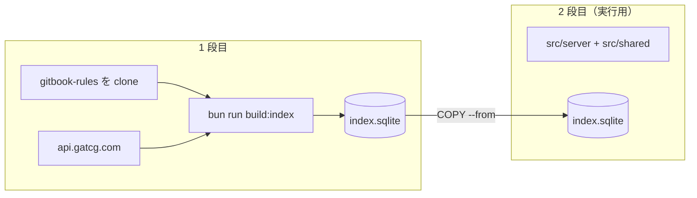
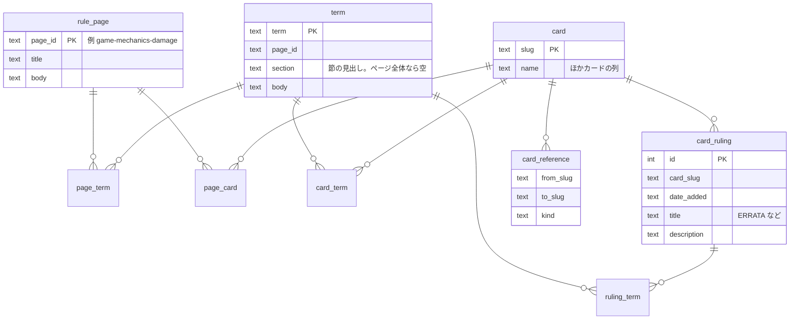

# Grand Archive ルール Q&A 用 MCP サーバー 設計書

## 目的

Grand Archive TCG のルールとカードについての質問に、利用者が自分の Claude / ChatGPT で答えを得られるようにする。推論は利用者側の LLM が行い、こちらは LLM を動かさない。

### 要件

- 非エンジニアが URL を貼るだけで使い始められる
- ルールの質問・「こんなカードある？」・カード同士の関係に答えられる
- 1 分以内に答える
- 正解が 1 通りに定まるゲームなので、答えを外さない。外しそうなときは「見つからない」と言わせる

### この設計の中心にある判断

サーバーは「答えるもの」ではなく「原文を出典つきで返すもの」にする。どの原文をどこまで返すかの判断を検索エンジンの当たり外れに任せず、目次とテーブルの結合で決まる形にする。

## 前提となる実測値（2026-09 時点）

| 対象                                                | 値                                                                                                                                             |
| --------------------------------------------------- | ---------------------------------------------------------------------------------------------------------------------------------------------- |
| ルール文書                                          | [weebsoftheshore/gitbook-rules](https://github.com/weebsoftheshore/gitbook-rules)。英語の Markdown 111 ファイル、368KB                         |
| ルールページ（用語集・変更履歴・目次を除く 104 枚） | 中央値 374 / 90% 1,402 / 最大 3,232 トークン                                                                                                   |
| 用語集                                              | `glossary/keywords-and-abilities.md` 64 節・`glossary/game-terms.md` 65 節。1 ファイル 1 万トークン前後、1 節は中央値約 120・最大 546 トークン |
| 目次 `SUMMARY.md`                                   | 2,714 トークン                                                                                                                                 |
| カード                                              | `api.gatcg.com` で 2,495 枚（edition 4,941）。英語版のみ                                                                                       |
| 公式裁定                                            | 478 枚に計 642 件                                                                                                                              |
| カード間の参照                                      | 257 枚から 372 本。最大 2 ホップ、閉路なし                                                                                                     |
| 索引一式                                            | SQLite 1 ファイル、約 2MB                                                                                                                      |

トークン数は英文 4 文字 ≒ 1 トークンで見積もった。

## 全体構成


## 配布とホスティング

- HTTPS のリモート MCP サーバーを 1 台置く。ChatGPT は手元で動く stdio のサーバーに接続できないため。
- 転送方式は Streamable HTTP の stateless モード。Cloud Run は台数 0 まで縮み、別の台が起き上がることもあるので、サーバーはセッションの状態を持たない。SSE は旧仕様なので使わない。
- 認証は付けない。OAuth を挟むと「URL を貼るだけ」の手順が成り立たない。
- `index.sqlite` をコンテナイメージに焼き込む。永続ボリュームも外部 DB も持たない。
- 置き場所は Google Cloud Run。リージョンは無料枠の対象になる米国（`us-central1` など）にする。サーバーを呼ぶのは利用者の PC ではなく Anthropic / OpenAI のクラウドなので、日本のリージョンにしても速くならない。
- 採らなかった置き場所
  - Render の無料プラン: 15 分リクエストが無いと停止し、起き上がりに約 1 分かかる。1 分要件を破る。
  - Fly.io: 新規アカウントに無料枠が無く月 $2〜4。Cloud Run より高いだけ。
  - Cloudflare Workers + D1: SQLite の拡張を載せられない。
- 濫用への備えは、Cloud Run の最大インスタンス数を 1 にして請求額に上限を付けること（最悪の場合で月 $60 前後）と、予算アラートを $5 に置くこと。Cloudflare の無料プランのレート制限は送信元 IP ごとにしか数えられず、リクエストは Anthropic / OpenAI のクラウドのわずかな IP から届くので、全利用者を 1 つの枠にまとめてしまう。使わない。

### 費用（1 日 100 質問 × 最大 8 回 = 月 2.4 万リクエストの場合）

| 項目                                                                                                                                      | 月額                                 |
| ----------------------------------------------------------------------------------------------------------------------------------------- | ------------------------------------ |
| Cloud Run（無料枠: 200 万リクエスト・18 万 vCPU 秒・36 万 GiB 秒・北米向け転送 1GB。この負荷は 1 リクエスト 1 秒と見ても 2.4 万 vCPU 秒） | $0                                   |
| Artifact Registry（無料枠 0.5GB、イメージは 100MB 前後）                                                                                  | $0                                   |
| GitHub Actions（毎日 2 分のビルドで月 60 分）                                                                                             | $0                                   |
| 独自ドメイン（任意。`*.run.app` で足りる）                                                                                                | $0（付けるなら年 $10〜15）           |
| LLM の推論                                                                                                                                | $0（利用者のサブスクリプション持ち） |

- 利用者の手順
  - Claude: Customize > Connectors > + > Add custom connector に URL を貼る。無料プランでもコネクタを 1 つ追加できる。
  - ChatGPT: Developer Mode を有効にしてからコネクタに URL を貼る。Plus 以上の有料プランでしか使えない。

## 実装基盤

取り込みもサーバーも TypeScript + Bun で書く。引用 ID の組み立て（取り込み）と解釈（サーバー）、テーブル定義を同じコードで共有し、両者の食い違いを型で防ぐ。SQLite は Bun 同梱の `bun:sqlite` を使う。Bun 1.4.2 同梱の SQLite 3.53.2 で `fts5(tokenize='porter unicode61')` が動くことを確かめた。

### リポジトリ構成

リポジトリ直下を 1 パッケージにする。

```
package.json      packageManager: "bun@1.4.2"
Dockerfile
.dockerignore     .git・.devcontainer・node_modules などを除く
src/
  server/         Hono + MCP。イメージの 2 段目に入る
  build/          取得 → index.sqlite。イメージの 1 段目だけで動く
  shared/         テーブル定義・引用 ID。両方の段に入る
```

- Bun のバージョンは `package.json` の `packageManager` を正とし、CI の `setup-bun` と Dockerfile の `oven/bun` のタグを合わせる。
- 採らなかった構成: Bun workspaces で 3 パッケージに分ける。取り込みは `fetch` と `bun:sqlite` で書け、分ける依存がほぼ無い。設定ファイルが 3 組になるだけ。

### データの取得と焼き込み

ルール文書もカードも頻繁に更新されるので、リポジトリに置かない。イメージを作るたびに最新を取得して焼き込む。`index.sqlite` は git の管理外にする。



- 取得は Dockerfile の中で行う。`docker build` 1 回で「最新を取得してイメージを作る」が済み、手元・CI・Cloud Build のどこでも同じものができる。
- 取得の直前に `ARG DATA_VERSION` を置き、ビルドごとに値を変える。レイヤーキャッシュが効くと、古いデータのまま新しいイメージができる。
- 採らなかった方法: CI で `index.sqlite` を作って Dockerfile で `COPY` する。手元の `docker build` だけでは DB が無いか古くなる。

### MCP の実装

公式 SDK `@modelcontextprotocol/sdk` の `WebStandardStreamableHTTPServerTransport` を Hono の `/mcp` から呼ぶ。`sessionIdGenerator: undefined` で stateless にし、リクエストごとに server と transport を作る。ツールの入力スキーマは zod で書く。

- SDK の transport は仕様どおり、POST の `Accept` に `application/json` と `text/event-stream` の両方が無いと 406 を返す。curl で試すときは両方を付ける。Claude・ChatGPT が両方を送るかは実機で確かめ、送らなければ Hono のミドルウェアで補う。
- 採らなかった方法: `@hono/mcp`。SDK を包むのではなく transport を独自に書き直したもの（0.3.2 で 560 行）で、仕様の改定への追従が SDK より遅れうる。利点は OAuth の補助と `Accept` の緩い判定だが、認証は付けず、利用者は仕様どおりのクライアントなので使わない。使わない認証のモジュールも無条件に読み込まれ、`hono-rate-limiter` が必須の peer として入る。

### 検査

| 検査         | ツール                                             |
| ------------ | -------------------------------------------------- |
| フォーマット | `oxfmt --check`（既定の設定）                      |
| リント       | `oxlint` + `oxlint-tsgolint`（型情報を使うルール） |
| 型           | `tsc --noEmit`                                     |
| テスト       | `bun test`                                         |

- 4 つを `bun run check` にまとめ、GitHub Actions で PR と main への push のたびに実行する。手元では devcontainer の `oxc.oxc-vscode` で保存時に整形する。pre-commit フックは置かない。
- Bun は型を見ずに実行し、oxlint・oxfmt も型を検査しないので、`tsc` を別に回す。
- `oxlint-tsgolint` を入れるのは `no-floating-promises` などを動かすため。`await` を書き忘れると、取得のエラーが握りつぶされて件数の足りない DB ができる。

## ビルド

### ルール文書の取り込み

1. 先頭の YAML（`---` で囲まれた GitBook のページ設定。3 ページにある）を捨てる。
2. `` ブロックを、直前の条文の続きとして本文に残す。`warning` / `danger` は「例外:」、`info` / `success` は「例:」を頭に付ける。**hint には条文を打ち消す例外が入っている**（例: `game-mechanics-damage.md` の規則 13 と、その直後の Immortality の例外）。捨てたり条文と切り離したりすると誤答になる。
3. `` タグと `&#x20;` を消す。画像はモデルに渡さない。
4. 各条文に**引用 ID**（回答で出典として示す識別子）を振る。書式は `ページID#節の見出し:番号`。例: `game-mechanics-damage#General Rules:10.a.i`。
   - 番号はページ内の `####` 節ごとに 1 から振り直されている。ルール文書に通し番号はない。
   - 入れ子の番号は GitBook の表示に合わせて `10.a.i` と書く。ルール本文の中の相互参照（「rule 10.a.i」）がこの書式で、ページ内を指している。
5. ページは分割しない。1 ページを 1 行として保存し、そのまま返す。最大でも 3,232 トークンなので分割する理由がなく、分割すると hint と条文が離れる。
6. 用語集の 2 ファイルだけは `####` 節ごとに分けて保存する。ファイル丸ごとだと 1 万トークンを超える。

### カードの取り込み

- `GET https://api.gatcg.com/cards/search?page_size=50&page=N` を `has_more` が false になるまで呼ぶ（約 50 回）。`page_size` の上限は 50。
- 既定の User-Agent では 403 が返る（Python の `urllib` で確認）。User-Agent を明示する。
- 保存する列: `slug`, `name`, `types`, `subtypes`, `classes`, `elements`, `cost_reserve`, `cost_memory`, `level`, `power`, `life`, `durability`, `speed`, `effect_raw`, `effect`。
- `rule`（公式裁定）と `references`（`kind` が SUMMON / STATUS / MASTERY / GENERATE / REFERENCE / BREW）は別テーブルに展開する。

### 用語の抽出（リンクを張る処理）

カード・裁定・ルールページと、用語の定義とを結ぶ。すべてビルド時の文字列照合で、実行時には計算しない。

- **語彙**: 全ページの `####` 見出しと、ページ題の最後の区切り（`# Game Zones - Intent` → `Intent`）から作る。約 300 語。用語集の見出しだけでは足りない。`Omen` は `game-mechanics-counters.md` の節に、`Intent` は 1 ページ丸ごとに定義があり、用語集には無い。
- **照合規則**
  - 大文字小文字を無視し、単語境界を付ける。
  - 複数形（末尾の `s`）も当てる。本文は `omens` と書く。
  - 長い語から先に当てる。短い語から当てると `Element Bonus` の中の `Element` を別の用語として二重に数える。
  - `effect` の太字（`**...**`）は使わない。`Class Bonus` は 906 枚に出るのに一度も太字になっておらず、逆に `On Enter:` のようにコロン込みで太字になった語が混ざる。
- **目で確かめる語**: `Link`・`Command`・`Brew`・`Vigor` のように一般語と紛れる短い語は、抽出結果を一度目視で確かめる。
- **カード名**: ルール本文にカード名が出る箇所も結ぶ。2 語以上かつ 8 文字以上の名前に限る（2,392 / 2,495 件）。短い名前は一般語と衝突する。2,392 語を一括で当てるので Aho-Corasick か正規表現の alternation を使う。

## データベース

SQLite 1 ファイル。通常のテーブルと結合と FTS5（全文検索）だけを使う。



`rule_page` と `card` には FTS5 の仮想テーブルを並べる。トークナイザは既定の `unicode61` に porter stemmer を足す。本文が英語なので日本語のトークナイザは要らない。

graph DB は使わない。参照は最大 2 ホップで閉路が無く、結合 1〜2 回で辿れる。将来深くなっても SQLite の `WITH RECURSIVE` で辿れる。

## ツール

どのツールも、戻り値のすべての条文・裁定に引用 ID を付ける。該当が無ければ推測の材料を返さず、該当が無いことだけを返す。

| ツール                    | 返すもの                                                                        | 返さないもの              | 大きさ                 |
| ------------------------- | ------------------------------------------------------------------------------- | ------------------------- | ---------------------- |
| `get_game_overview()`     | ゲームの概要（次節）と、目次を「題 \| ページID」にしたもの                      | —                         | 約 5,500 トークン      |
| `get_rules_page(page_id)` | ページ丸ごと（hint を展開済み）                                                 | 画像                      | 最大 3,232             |
| `get_term(term)`          | 用語の定義 1 つ（節、またはページ）                                             | 用語集ファイル丸ごと      | 用語集の節なら最大 546 |
| `search_rules(query)`     | 上位 10 件の引用 ID・題・該当する 1 行                                          | 本文                      | 約 500                 |
| `search_cards(...)`       | 1 枚 1 行（名前・種別・クラス・元素・コスト・効果の冒頭）を最大 20 件と、総件数 | 効果全文・裁定            | 20 件で約 700          |
| `get_card(names)`         | 最大 5 枚。保存した列・裁定全件・用語名とその引用 ID・参照先カード名            | 用語の本文、API の生 JSON | 1 枚約 340             |

- `search_cards` は 20 件で打ち切り、「906 件中 20 件。条件を足してください」のように総件数を添える。打ち切らないと `Class Bonus` 持ちだけで 3 万トークンを超え、claude.ai の上限（約 15 万字）に届く。
- `get_card` は裁定を必ず同梱する。裁定には ERRATA があり、カードの印刷面や API の列より新しいことがある。Beguiling Coup では `Command` と `Taunt` の扱いが効果テキストには無く、裁定にしか無い。
- `search_cards` の絞り込み条件（クラス・元素・種別・サブタイプ）は、入力スキーマに `enum` で並べず自由文字列で受ける。サーバー側で照合し、合わなければ候補を返す。Claude Desktop はリモートコネクタのツールのうち、入力スキーマが 16,384 バイトを超えるものをエラーなしで一覧から落とす。
- 変更履歴の `README.md`（8,738 トークン）はどのツールからも返さない。

質問 1 つあたりの総量は、`get_game_overview` を含めて 5,000〜1 万トークンになる見込み。

## 最初に渡すゲームの概要

このゲームはモデルの学習データにほとんど含まれていない。ルールを 1 つ調べる前に、ゲームの全体像を渡す。

### 届け方

| 置き場所                     | 書くこと                                                                                                                                                                                                          |
| ---------------------------- | ----------------------------------------------------------------------------------------------------------------------------------------------------------------------------------------------------------------- |
| サーバーの `instructions`    | 先頭 512 字に「Grand Archive TCG の質問では、答える前に `get_game_overview` を呼び、原文を引いてから答える」。ChatGPT はこれを使う。claude.ai / Claude Desktop が使うかは確認できていないので、ここだけに頼らない |
| 各ツールの説明文             | `get_game_overview` の説明に「Grand Archive の話題では最初に呼ぶ」。どのクライアントでも説明文はモデルに届く                                                                                                      |
| `get_game_overview` の戻り値 | 概要の本文                                                                                                                                                                                                        |

本文を説明文に入れない。説明文はゲームと関係ない会話でも毎回読み込まれ、利用者の文脈を無駄に使う。MCP の prompt / resource は利用者が画面で選んで添付しない限り入らないので使わない。

### 本文

ルール文書から原文を抜き出して作り、ビルドのたびに作り直す。手書きの要約にしない。概要の誤りはすべての回答に染みる。

| 抜き出すページ                        | 大きさ | 分かること                                                 |
| ------------------------------------- | ------ | ---------------------------------------------------------- |
| `general-rules-objectives.md`         | 286    | 勝利条件                                                   |
| `game-mechanics-turn-order/README.md` | 560    | フェイズの順番と、先攻・後攻が最初のターンに飛ばすフェイズ |
| `general-rules-starting-the-game.md`  | 901    | ゲームの準備                                               |
| `game-mechanics-game-zones/README.md` | 964    | 領域                                                       |
| `general-rules-card-types/README.md`  | 117    | カード種別                                                 |

手書きするのは次の 3 つだけ。

1. このゲームが何かを 1〜2 文。「Magic: The Gathering などに似ているが別のゲームで、あなたが元から持っている知識は当てにならない」と書く。
2. 他の TCG と紛らわしい用語の一覧。たとえば `Opportunity` は MTG の priority に近い役割を持つが、語もルールも違う。`Intent`・`Materialize`・`Recollection` は他のゲームに無い語。モデルは知らない語を似たゲームの知識で埋めようとするので、ここで止める。
3. 「この概要は全体を見渡すためのもの。これを根拠に答えない。答える前に該当ページを引いて引用する」。

## 採らなかった技術

| 技術                           | 採らない理由                                                                                                                                                                                                  |
| ------------------------------ | ------------------------------------------------------------------------------------------------------------------------------------------------------------------------------------------------------------- |
| 埋め込みとベクトル検索         | 「手札に戻す」と「デッキに戻す」、コスト 2 と 3 のような、意味が近くて答えが違う文を区別できない。質問文の埋め込みを作るモデルを同梱すると配布物が 100MB を超え、API を使うと利用者に鍵を設定させることになる |
| ページのチャンク分割           | hint の例外と条文が切り離される。ページは最大 3,232 トークンで分割しなくても収まる                                                                                                                            |
| graph DB                       | 参照が最大 2 ホップで閉路が無い。JVM などが増え、「SQLite 1 ファイルを焼き込むだけ」の形が崩れる                                                                                                              |
| 手元で動く `.mcpb` を主にする  | ChatGPT が stdio のサーバーに接続できない。データ更新のたびに配り直しになる                                                                                                                                   |
| OpenAI Secure MCP Tunnel       | 利用者が手元で `tunnel-client` を動かし続ける必要があり、非エンジニア向けでない                                                                                                                               |
| ファインチューニング           | 配布できず、カードが増えるたびに作り直しになる                                                                                                                                                                |
| ルールを全部プロンプトに入れる | ルールとカードで 35 万トークン前後あり、1 回の文脈に入らない                                                                                                                                                  |
| 手書きの用語対応表             | 用語集とページの見出しが語彙そのもの。カード名もキーワード名も英語でしか存在しないので、利用者の入力も英語の固有名詞になる                                                                                    |

## 検証

- **質問と正解の組を 100 問作り、自動で採点する。**正解が 1 通りのゲームなので採点できる。`search_rules` が本当に要るのか、目次を辿るだけで足りるのかはここで決める。
- 100 問には、**MTG の常識で答えると間違える問題**を混ぜる。概要の「紛らわしい用語の一覧」が効いているかを確かめるには、これしか方法が無い。
- **裁定にしか答えが無い問題**を混ぜる（例: Beguiling Coup で Command 持ちの攻撃 omen を選んだときの扱い）。`get_card` が裁定を同梱していることを確かめる。
- 運用中は、サーバーのアクセスログから、該当なしを返した質問を集める。語彙の抜けと、目次からモデルが辿れなかったページはここで見つかる。

## 未決事項

- **ルール文書とカードデータを再配布してよいか。**`gitbook-rules` にはライセンスの記載が無い（GitHub の API で `license: null`）。`api.gatcg.com` の利用条件も確かめていない。公開サーバーで原文を返す前に、Weebs of the Shore に確認する。
- **claude.ai / Claude Desktop が `instructions` をモデルに渡すか。**渡さなくても説明文で誘導できる設計にしてあるが、実機で確かめる。
- **再ビルドの頻度とデプロイ。**`gitbook-rules` の最終更新は 2026-09-17。ルールとカードの更新を検知して作り直す仕組みの粒度（毎日か、更新検知か）と、Cloud Run への反映方法を決める。
- **取得したデータが壊れていたときにビルドを止める条件。**イメージのたびに外から取得するので、取得先の異常がそのまま本番に出る。件数の下限・概要に使う 5 ページの有無・引用 ID の重複などを、取り込みの実装時に決める。
