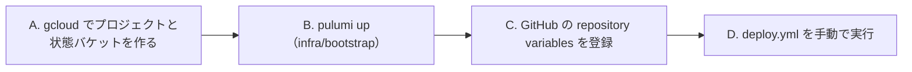

# デプロイの準備（人が手元でやること）

Cloud Run へのデプロイは GitHub Actions の `deploy.yml` が `infra/app` を `pulumi up` して行う。ただし、GCP のプロジェクト・Pulumi の状態バケット・CI が GCP に入るための認証（`infra/bootstrap`）は、CI に IAM を作る権限を渡さないため、人が自分の `gcloud` の認証で作る。



以下、`<PROJECT_ID>` は GCP のプロジェクト ID（例: `ga-rules-mcp`）、`<BUCKET>` は `<PROJECT_ID>-pulumi-state` に置き換える。

## A. プロジェクトと状態バケットを作る

devcontainer を作り直したあとで行う（`pulumi` と `gcloud` は `.devcontainer/Dockerfile` で入る）。

```sh
gcloud auth login
gcloud auth application-default login   # Pulumi はこちらの認証で GCP を操作する

gcloud projects create <PROJECT_ID>
gcloud billing accounts list            # ACCOUNT_ID を控える
gcloud billing projects link <PROJECT_ID> --billing-account=<ACCOUNT_ID>
gcloud config set project <PROJECT_ID>
gcloud auth application-default set-quota-project <PROJECT_ID>

# 残りの API は infra/bootstrap が有効にする。その操作に要る 2 つだけ先に有効にする
gcloud services enable serviceusage.googleapis.com cloudresourcemanager.googleapis.com

gcloud storage buckets create gs://<BUCKET> --location=us-central1 --uniform-bucket-level-access
gcloud storage buckets update gs://<BUCKET> --versioning   # 状態ファイルを壊したときに戻せるようにする
```

- バケットは `us-central1` に置く。Cloud Storage の無料枠（5GB）は米国の 3 リージョンだけが対象。
- 課金アカウント ID はリポジトリ（公開）に書かない。B で環境変数として渡す。

## B. `infra/bootstrap` を適用する

```sh
export PULUMI_CONFIG_PASSPHRASE=""   # 暗号化して保存する値が無いので空でよい
export GCP_BILLING_ACCOUNT=<ACCOUNT_ID>
export GOOGLE_PROJECT=<PROJECT_ID>   # Pulumi の GCP provider はプロジェクトをこの環境変数から読む
pulumi login gs://<BUCKET>
cd infra/bootstrap
pulumi stack select --create prod
pulumi up
```

予算アラート（¥1,000 の 50%・90%・100%）のメールは、課金アカウントの管理者に届く。予算の通貨は請求先アカウントの通貨と揃える必要があり、このアカウントは JPY。

Compute Engine API が無効だという警告（`failed to get regions list`）が出るが、GCP provider がリージョンの一覧を取れないだけで、適用には影響しない。

## C. GitHub の repository variables を登録する

値は秘密ではないので、secrets ではなく variables に置く。

```sh
cd infra/bootstrap
gh variable set GCP_PROJECT  --body <PROJECT_ID>
gh variable set STATE_BUCKET --body <BUCKET>
gh variable set WIF_PROVIDER --body "$(pulumi stack output workloadIdentityProvider)"
gh variable set DEPLOY_SA    --body "$(pulumi stack output deployServiceAccount)"
```

## D. 初回のデプロイ

```sh
gh workflow run deploy.yml
gh run watch
```

スモークテストの step が通ったら、`infra/app` の出力 `url` が利用者に配る URL になる。

```sh
cd infra/app && pulumi stack output url
```

claude.ai の Customize > Connectors > Add custom connector にこの URL を貼り、`get_game_overview` が呼ばれることを確かめる。

## E. 濫用への備えを確かめる（初回のデプロイのあと 1 回）

### 回数制限が送信元の書いた IP に騙されないこと

`X-Forwarded-For` の左側を毎回変えて 121 件送り、最後が 429 になることを確かめる。左側で数えていれば 121 件すべて通ってしまう。全体の枠（1 秒 10 件）に掛からないよう間を空けて送り、IP ごとの枠は時計の分の切れ目で数え直すので、分の頭から始める。

```sh
URL=$(cd infra/app && pulumi stack output url)
sleep $((60 - 10#$(date +%S)))
for i in $(seq 121); do
  curl -s -o /dev/null -w '%{http_code}\n' -X POST "$URL" \
    -H "X-Forwarded-For: 10.0.0.$i" -H 'content-type: application/json' \
    -H 'accept: application/json, text/event-stream' \
    -d '{"jsonrpc":"2.0","id":1,"method":"tools/list"}'
  sleep 0.15
done | sort | uniq -c   # 200 が 120 件、429 が 1 件
```

### 予算を超えたら止まること

予算の通知を装ったメッセージを送り、Cloud Run の ingress が内部だけに切り替わることを確かめる。

```sh
gcloud pubsub topics publish ga-rules-budget --message='{"costAmount":2000,"budgetAmount":1000}'
sleep 60
gcloud run services describe ga-rules --region=us-central1 --format='value(metadata.annotations."run.googleapis.com/ingress")'
# internal になっていればよい。gcloud workflows executions list ga-rules-stopper --location=us-central1 で実行結果も見られる
gh workflow run deploy.yml   # ingress を all に戻す
```

## 止まったときに戻す

予算 ¥1,000 を超えると、Cloud Run は外からのリクエストを受けなくなる。原因（Cloud Logging のアクセスログ）を確かめてから `gh workflow run deploy.yml` を実行すると、`infra/app` の `pulumi up` が ingress を全体に戻す。予算を超えたままだと、次の予算の通知（1 日に数回）でまた止まる。その月のあいだ公開を続けるなら、`infra/bootstrap/index.ts` の予算額を上げて B をやり直す。

月が替わって集計が 0 に戻っても、自動では公開に戻らない。濫用が続いていると、また予算分だけ掛かってから止まるため。戻すのは上の手順で人が行う。

## 注意

- 認証なしの公開は、Cloud Run の `invokerIamDisabled` で行う。個人の Gmail アカウントで作ったプロジェクトは組織に属さないので使える。組織の下に作った場合は、組織ポリシーで IAM の確認を外すことが禁じられていると、`infra/app` の適用が失敗する。
- WIF は、リポジトリ ID `1395664644`（`Luna-rab/ga-rules`）の main ブランチからの実行だけを通す。リポジトリを作り直すと ID が変わるので、`infra/bootstrap` の設定を直して B をやり直す。
